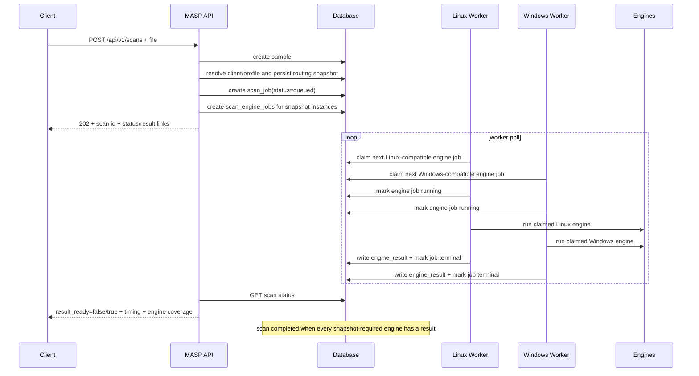
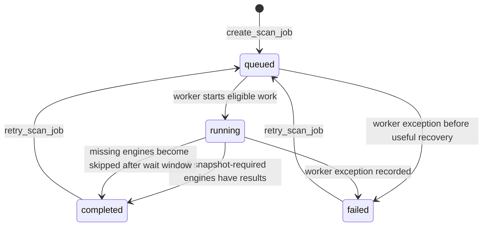
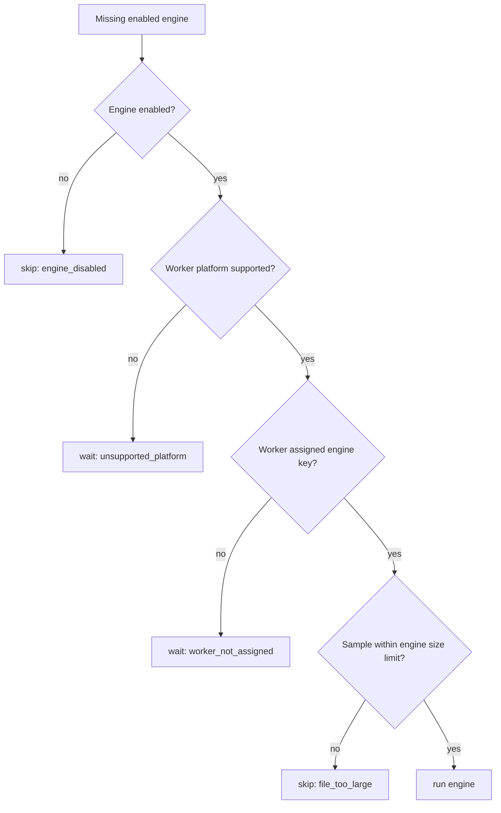

# MASP Scan Execution Flow

This document explains the current scan execution flow in MASP. It is meant as
a technical reference for performance work, queue behavior, worker scaling, and
future scheduling changes.

The most important idea: MASP is not only "upload file, run engines." It is a
distributed orchestration flow where the API stores a scan job, one or more
workers write engine results, and the scan becomes complete only when all
engines required by the accepted scan's routing snapshot have a result or the
missing engines are finalized as skipped.

## Core Components

The current flow is spread across a few key modules:

- API entrypoints: [`app/main.py`](../../app/main.py)
- Scan/job persistence: [`app/database.py`](../../app/database.py)
- Worker loop: [`app/workers/scan_worker.py`](../../app/workers/scan_worker.py)
- HTTPS worker agent: [`app/workers/control_api_worker.py`](../../app/workers/control_api_worker.py)
- Worker control plane: [`app/services/worker_control.py`](../../app/services/worker_control.py)
- Engine registry and adapter dispatch: [`app/services/engine_registry.py`](../../app/services/engine_registry.py)
- Service-client identity, profile routing and snapshots: [`app/services/service_clients.py`](../../app/services/service_clients.py)
- Worker capability filtering: [`app/services/worker_capabilities.py`](../../app/services/worker_capabilities.py)
- Engine routing/skip reasons: [`app/services/routing.py`](../../app/services/routing.py)
- Timing calculations: [`app/services/timing.py`](../../app/services/timing.py)
- Benchmark aggregation: [`app/services/benchmarking.py`](../../app/services/benchmarking.py)
- Benchmark CLI: [`tools/benchmark_scans.py`](../../tools/benchmark_scans.py)

For a focused throughput analysis and optimization plan, see
[`WORKER_THROUGHPUT_OPTIMIZATION.md`](WORKER_THROUGHPUT_OPTIMIZATION.md).
For the additive engine-level queue foundation, see
[`ENGINE_JOB_QUEUE.md`](ENGINE_JOB_QUEUE.md).

Useful line references at the time this document was written:

- API create scan: [`app/main.py:4062`](../../app/main.py#L4062)
- API status payload: [`app/main.py:843`](../../app/main.py#L843)
- API result payload: [`app/main.py:870`](../../app/main.py#L870)
- Upload storage and scan creation helper: [`app/main.py:903`](../../app/main.py#L903)
- Scan summary payload including timing: [`app/main.py:773`](../../app/main.py#L773)
- Scan row creation: [`app/database.py:1009`](../../app/database.py#L1009)
- Engine job creation: [`app/database.py:1290`](../../app/database.py#L1290)
- Engine job claim: [`app/database.py:1376`](../../app/database.py#L1376)
- Mark scan running: [`app/database.py:1656`](../../app/database.py#L1656)
- Update scan terminal status: [`app/database.py:1700`](../../app/database.py#L1700)
- Worker engine-job tick: [`app/workers/scan_worker.py:112`](../../app/workers/scan_worker.py#L112)
- Worker engine-job processing: [`app/workers/scan_worker.py:150`](../../app/workers/scan_worker.py#L150)
- Scan finalization: [`app/workers/scan_worker.py:480`](../../app/workers/scan_worker.py#L480)
- Worker outer loop: [`app/workers/scan_worker.py:682`](../../app/workers/scan_worker.py#L682)
- Worker default capability split: [`app/services/worker_capabilities.py:7`](../../app/services/worker_capabilities.py#L7)
- Engine routing decisions: [`app/services/routing.py:31`](../../app/services/routing.py#L31)
- Timing payload: [`app/services/timing.py:30`](../../app/services/timing.py#L30)
- Benchmark run model: [`app/services/benchmarking.py:9`](../../app/services/benchmarking.py#L9)
- Benchmark summary aggregation: [`app/services/benchmarking.py:42`](../../app/services/benchmarking.py#L42)
- Benchmark polling flow: [`tools/benchmark_scans.py:281`](../../tools/benchmark_scans.py#L281)

## High-Level Flow



The API does not synchronously scan the file itself. It stores the sample and
creates a queued job. Workers later turn that job into engine results.

## API Submission Flow

The primary service-to-service entrypoint is `POST /api/v1/scans`.

Current route:

- [`app/main.py:4052`](../../app/main.py#L4052): `api_create_scan`
- [`app/main.py:892`](../../app/main.py#L892): `enqueue_scan_from_upload`
- [`app/database.py:914`](../../app/database.py#L914): `create_scan_job`

The flow is:

1. The client uploads a file with metadata such as `case_name`, `priority`,
   `note`, and optional `wait_seconds`.
2. Bearer authentication resolves one service client and its enabled default
   profile.
3. Source/quota rules filter the profile's explicit engine instance set.
4. `store_upload()` persists the sample and computes hashes.
5. Sample, scan, client/profile IDs, immutable routing snapshot, and engine jobs
   are committed together.
6. The API returns a status payload.
7. If `wait_seconds > 0`, the API briefly waits for terminal completion using
   [`wait_for_terminal_scan`](../../app/main.py#L877). This is only a
   convenience. The primary model remains asynchronous polling.

Important API behavior:

- `202 Accepted`: scan accepted but not complete.
- `200 OK`: scan completed inside the requested wait window.
- `GET /api/v1/scans/{id}` returns scan state, queue state, engine progress,
  links, and timing.
- `GET /api/v1/scans/{id}/result` returns normalized final result only after
  the scan reaches terminal state. Otherwise it returns `409 Conflict`.

## Scan State Lifecycle



The main scan statuses are:

- `queued`: scan exists but no worker has started meaningful work yet.
- `running`: at least one worker has started or the scan is being revisited.
- `completed`: all engines required by the accepted snapshot have a result record, including skipped
  results for missing/unavailable engines.
- `failed`: worker processing failed in a way that could not be normalized into
  engine results.

The scan is considered ready by the API when its status is one of the terminal
states:

- `completed`
- `failed`

See `API_TERMINAL_SCAN_STATUSES` in [`app/main.py`](../../app/main.py).

## Worker Execution Flow

The worker process starts at [`run_forever`](../../app/workers/scan_worker.py#L682).
Inside the loop it calls [`process_next_scan_job`](../../app/workers/scan_worker.py#L636).

Current behavior:

1. Worker discovers its engine keys via
   [`worker_engine_keys`](../../app/services/worker_capabilities.py#L23).
2. A `database` transport worker claims directly through
   `claim_next_scan_engine_job`; a `control_api` worker claims through the HTTPS
   endpoint and receives no database credential.
3. The claim is capability-specific: a Defender worker claims Defender jobs,
   a ClamAV worker claims ClamAV jobs, and so on.
4. Control-API workers download the owned sample, enforce its declared size,
   verify SHA-256, and scan a temporary local copy. Database workers retain the
   shared-storage compatibility path.
5. The adapter result and terminal transition commit under the same worker plus
   attempt-generation fence. Control-API finalization runs on the MASP server;
   the remote agent cannot mutate scoring or archive state directly.

The scheduling model is now:

```text
Claim the oldest engine job this worker can actually run.
Run exactly that engine job.
Then end this worker tick.
```

The legacy scan-centric code path still exists in the tree, but the worker no
longer runs it: `run_forever()` refuses to start (`SystemExit`) if either
`MASP_LEGACY_SCAN_WORKER_FALLBACK_ENABLED=1` or the engine-job queue is disabled
(`MASP_ENGINE_JOB_QUEUE_ENABLED=0`). It reintroduces head-of-line and
timeout/skipped races and, because it finalizes with the old
completed-then-extract ordering, the archive completion/child crash gap the
`finalizing` state machine closes. Only the fenced engine-job path is supported.

## Worker Capability Split

Default worker capabilities are defined in
[`app/services/worker_capabilities.py:7`](../../app/services/worker_capabilities.py#L7):

```python
WINDOWS_DEFAULT_ENGINE_KEYS = ("static_metadata", "microsoft_defender")
POSIX_DEFAULT_ENGINE_KEYS = ("static_metadata", "clamav", "yara")
```

That means:

- A Linux worker normally runs `static_metadata`, `clamav`, and `yara`.
- A Windows worker normally runs `static_metadata` and `microsoft_defender`.
- `MASP_WORKER_ENGINE_KEYS` can override the engine assignment.
- Unsupported engine/platform combinations are filtered out.

The shipped dev/pilot/production Compose files explicitly add `virustotal` to
the Linux worker assignment so explicitly initiated manual file scans can run
the hash-reputation job. REST and ICAP source eligibility still excludes that
quota-consuming adapter before jobs are created.

This is why the system may have multiple workers but still behave as if one
pipeline is the bottleneck. If ClamAV/YARA are slow and only one Linux worker is
available, the Windows worker cannot compensate for that Linux-side bottleneck.

## Engine Routing

Routing happens in [`route_engine_for_worker`](../../app/services/routing.py#L31).
For each missing enabled engine, the worker decides:

- `run`: this worker can execute the adapter for this sample.
- `wait`: this worker cannot run it, but another worker might.
- `skip`: this engine should not run for this scan and can be recorded as a
  skipped result.

Common reasons:

- `engine_disabled`
- `worker_not_assigned`
- `unsupported_platform`
- `file_too_large`
- `worker_timeout`

Simplified decision tree:



Skipped engine results are normalized through
[`build_skipped_engine_result`](../../app/services/routing.py#L131). This is
important because a completed scan can still have partial coverage. In that
case, the scan is complete but the decision may be `review` instead of `allow`
or `block`, depending on scoring and coverage.

Skipped result `duration_ms` is synthetic and must not be interpreted as AV
adapter runtime. Timeout and wait-window context belongs in result details and
worker timing events.

## Engine Execution Inside One Worker

Inside the engine-job queue path, one worker tick handles one claimed engine
job:

```python
job = claim_next_scan_engine_job(engine_keys, worker_id)
mark_scan_engine_job_running(job.id, worker_id)
result = run_engine(engine, scan)
create_engine_result_if_missing(scan.id, result)
mark_scan_engine_job_terminal(job.id, result.status)
```

Reference: [`app/workers/scan_worker.py:150`](../../app/workers/scan_worker.py#L150)

This means a split Linux setup can claim these as separate jobs:

- Static Metadata
- ClamAV
- YARA

Each worker process still runs its claimed adapter call synchronously, but slow
engines no longer force a single scan-centric loop to inspect unrelated missing
engines before finding useful work.

The per-engine job runtime tends toward:

```text
adapter duration
+ result persistence
+ job terminal update
+ finalization check
```

## Completion Rules

In the engine-job queue path, scan finalization happens in
[`finalize_scan_if_complete`](../../app/workers/scan_worker.py#L480).

A scan becomes `completed` when every enabled engine has a corresponding result
record. That result can be:

- `completed`
- `failed`
- `skipped`

The exact helper is
[`all_enabled_engines_have_results`](../../app/services/worker_capabilities.py#L69).

The legacy scan-centric path can still record timeout `skipped` results after
the orchestration wait window expires. The engine-job queue path intentionally
does not treat queue wait as engine execution timeout; that policy will move to
explicit engine-job timeout/SLA handling.

For the legacy path, the wait window is computed by
[`partial_results_wait_seconds`](../../app/workers/scan_worker.py#L542):

- It checks missing engines' configured `timeout_seconds`.
- It adds `MASP_ENGINE_TIMEOUT_GRACE_SECONDS`.
- It clamps the value between:
  `MASP_SCAN_PARTIAL_RESULTS_MIN_WAIT_SECONDS` and
  `MASP_SCAN_PARTIAL_RESULTS_MAX_WAIT_SECONDS`.

That legacy rule lets the product warn about missing engines but still finish
the scan. In the queue path, missing-compatible-worker and overall scan SLA
should be modeled at the engine-job layer instead.

## Concurrency Semantics

This is the most important section for optimization.

Current behavior uses an engine-level distributed queue, but each worker process
still executes one claimed adapter call at a time.

### What is serial today?

Within one worker process:

- The worker loop handles one useful unit of work per tick.
- That unit is one claimed engine job.
- Local adapter execution is blocking inside that worker process.

### What can be concurrent today?

Across multiple worker processes:

- Linux and Windows workers can work at the same time.
- Different workers can claim different engine jobs for the same scan.
- Different workers can progress different scans without scanning the same
  active scan window.

### Is upload order equal to completion order?

No. Upload order is not a completion guarantee.

Usually, older scans are considered first because
[`claim_next_scan_engine_job`](../../app/database.py#L1376) orders jobs by
`scan_jobs.created_at ASC, scan_jobs.id ASC, scan_engine_jobs.id ASC`. But a
later scan can finish first if:

- an earlier scan waits for a slow or unavailable engine,
- a later scan has faster engine coverage,
- different workers claim different engine jobs,
- one engine is skipped due to routing or timeout,
- resource contention changes per-scan processing time.

So the current model has FIFO claim tendency, not FIFO completion guarantee.

## Timing Model

Timing is computed centrally in
[`build_scan_timing_payload`](../../app/services/timing.py#L30).

It uses existing scan timestamps:

- `created_at`
- `started_at`
- `completed_at`
- `failed_at`

No database migration is required for these metrics.

The timing payload is:

```json
{
  "queue_wait_ms": 1316,
  "processing_duration_ms": 5403,
  "total_duration_ms": 6719,
  "age_ms": 7000,
  "processing_age_ms": 5600
}
```

Meaning:

- `queue_wait_ms`: `started_at - created_at`
- `processing_duration_ms`: `completed_at/failed_at - started_at`
- `total_duration_ms`: `completed_at/failed_at - created_at`
- `age_ms`: `now - created_at`
- `processing_age_ms`: `now - started_at`

For a completed scan:

```text
total_duration_ms = queue_wait_ms + processing_duration_ms
```

For a queued scan:

- `queue_wait_ms` is `null`
- `processing_duration_ms` is `null`
- `total_duration_ms` is `null`
- `age_ms` continues increasing

For a running scan:

- `queue_wait_ms` is known
- `processing_duration_ms` is `null`
- `total_duration_ms` is `null`
- `processing_age_ms` continues increasing

The API exposes this inside `scan.timing` through
[`build_scan_summary_payload`](../../app/main.py#L766).

## Benchmark Flow

The benchmark tool intentionally uses the public API instead of private
internals:

- [`tools/benchmark_scans.py:78`](../../tools/benchmark_scans.py#L78): CLI entry
- [`tools/benchmark_scans.py:156`](../../tools/benchmark_scans.py#L156): submit phase
- [`tools/benchmark_scans.py:281`](../../tools/benchmark_scans.py#L281): poll phase
- [`tools/benchmark_scans.py:437`](../../tools/benchmark_scans.py#L437): API payload parsing
- [`app/services/benchmarking.py:42`](../../app/services/benchmarking.py#L42): summary aggregation

Typical command:

```powershell
.\.venv\Scripts\python.exe tools\benchmark_scans.py `
  --base-url http://localhost:8000 `
  --token test-token `
  --sample storage\samples\0396e2b8e3fa4f22973a78f213d90636_eicar.com `
  --requests 10 `
  --concurrency 2 `
  --poll-interval 1 `
  --timeout 300 `
  --output benchmark-results\run-03.json
```

The important benchmark metrics are:

- `submit_*`: API upload/acceptance latency.
- `queue_wait_*`: time waiting before worker processing starts.
- `processing_*`: time from worker start to terminal state.
- `total_*`: end-to-end scan time from creation to terminal state.
- `partial_runs`: completed scans where fewer engines reported than expected.

Interpretation examples:

```text
High submit latency:
API upload, auth, DB insert, storage, or network overhead.

High queue_wait latency:
Worker capacity or scheduling bottleneck.

High processing latency:
Engine runtime, serial execution, engine contention, file size, or worker CPU/IO bottleneck.

High total latency:
Usually queue_wait + processing. Split them before optimizing.
```

## What The Local Benchmarks Showed

The latest local benchmark runs used:

- sample: `0ebc0530f0804356a12f89b1298c8a51_main.py`
- sample size: `13,858 bytes`
- enabled engines: `static_metadata`, `clamav`, `yara`, `microsoft_defender`
- all runs completed
- no partial results
- all scans returned `low` and `allow`

Summary:

```text
local-run-01:
requests:        5
concurrency:     2
submit_avg:      192 ms
queue_wait_avg:  2460 ms
processing_avg:  3973 ms
total_avg:       6434 ms

local-run-02:
requests:        10
concurrency:     3
submit_avg:      272 ms
queue_wait_avg:  3317 ms
processing_avg:  4498 ms
total_avg:       7815 ms
```

This tells us:

- API acceptance is fast.
- Queue wait grows as request volume and concurrency grow.
- Processing also grows, which points at worker/engine execution pressure.
- Correctness held under this light load: every scan completed with all four
  engine results.

That pattern suggests worker/engine execution is the main place to optimize
next, but not blindly. We should compare benchmark runs while changing only one
variable at a time. See
[`WORKER_THROUGHPUT_OPTIMIZATION.md`](WORKER_THROUGHPUT_OPTIMIZATION.md) for the
focused optimization plan.

## Current Bottlenecks and Risks

### 1. Blocking adapter execution inside one worker

Evidence:

- [`app/workers/scan_worker.py:150`](../../app/workers/scan_worker.py#L150)

Impact:

- A worker process cannot claim another engine job while a blocking adapter call
  is running.
- Worker throughput is limited when engines are local CLIs or blocking calls.

Optimization options:

- Run independent engines in parallel inside a worker.
- Split engines across more worker processes.
- Use per-engine worker pools.

Risks:

- Duplicate engine results if locking is weak.
- Local AV engines may not tolerate high parallelism.
- CPU, disk, or socket pressure can make each scan slower even if concurrency
  increases.

### 2. Engine-job queue migration risk

Evidence:

- [`app/database.py:1376`](../../app/database.py#L1376)
- [`app/workers/scan_worker.py:112`](../../app/workers/scan_worker.py#L112)

Impact:

- Workers now claim engine jobs directly, reducing active-scan head-of-line
  behavior.
- Lease expiry protects against worker crashes, but retry semantics must remain
  conservative.
- Finalization requires terminal `scan_engine_jobs` coverage plus matching
  `engine_results` rows.

Optimization options:

- Add explicit queue timeout, execution timeout, lease timeout, and scan SLA
  policies.
- Expose engine-job queue metrics in the API/status surface.

Risks:

- More tables/state transitions.
- More recovery logic for worker crashes.
- Need strong idempotency to avoid duplicate engine results.

### 3. Worker capability imbalance

Evidence:

- [`app/services/worker_capabilities.py:7`](../../app/services/worker_capabilities.py#L7)

Impact:

- Linux engines and Windows Defender are not interchangeable.
- More Windows capacity will not speed up ClamAV/YARA.
- More Linux capacity will not speed up Defender.

Optimization options:

- Scale the bottleneck worker type specifically.
- Run multiple Linux workers for ClamAV/YARA if engines tolerate it.
- Run multiple Defender workers on separate Windows nodes.

Risks:

- Direct-database workers require shared sample visibility. HTTPS control workers
  instead stream only their owned sample and verify its size and SHA-256 locally.
- Local AV engines may serialize internally.
- More workers increase DB write contention.

### 4. Completion waits for all enabled engines

Evidence:

- [`app/workers/scan_worker.py:104`](../../app/workers/scan_worker.py#L104)
- [`app/services/worker_capabilities.py:69`](../../app/services/worker_capabilities.py#L69)

Impact:

- One slow or missing engine delays terminal scan state.
- Partial finalization protects against infinite running state, but the wait
  window still affects latency.

Optimization options:

- Product-level "minimum required engines" policy.
- Early decision mode for high-confidence detections.
- Return `block` early while continuing background coverage.

Risks:

- Security policy must be explicit.
- Early allow is more dangerous than early block.
- API consumers need a clear contract for partial vs final results.

## Recommended Optimization Order

Do not jump straight to parallel engine execution. The safer order is:

1. Keep collecting benchmark data with `queue_wait` and `processing` split.
2. Run controlled tests:
   `10/50/100 requests`, same file, same workers.
3. Scale only Linux workers and compare.
4. Scale only Windows workers and compare.
5. Identify which engine dominates `processing_duration_ms`.
6. Benchmark the engine-job queue path against the old scan-centric baseline.
7. Add explicit queue timeout, execution timeout, lease timeout, and scan SLA
   policies if benchmark behavior requires them.
8. Consider parallel engine execution after idempotency and resource limits are
   explicit.

The key discipline: change one variable per benchmark run.

## Questions To Answer Before Scheduler Refactor

Before changing the worker architecture, answer these:

- Do we want scan-level concurrency, engine-level concurrency, or both?
- Can the same engine run multiple scans at once safely?
- Should every engine be required for final completion?
- Should malicious detections allow early `block` before all engines finish?
- How many concurrent ClamAV streams can the clamd container handle?
- How many concurrent Defender scans can one Windows node handle?
- Do we need per-tenant or per-integration rate limits?
- What is the expected API SLA:
  immediate accepted response, final verdict within N seconds, or both?

## Mental Model

Think of MASP as three layers:

```text
API layer:
Accepts files quickly and creates durable scan jobs.

Orchestration layer:
Routes missing engine work to compatible workers and decides when a scan is complete.

Engine layer:
Runs blocking local/network adapters and normalizes their output into engine_results.
```

Most performance problems should be diagnosed by asking:

```text
Is this upload/API time?
Is this queue wait time?
Is this worker processing time?
Is this one engine dominating?
Is this missing-engine wait time?
```

The current `scan.timing` and benchmark output are designed to answer the first
three. Per-engine metrics and System page metrics help with the fourth. Routing
details and skipped engine reasons help with the fifth.
